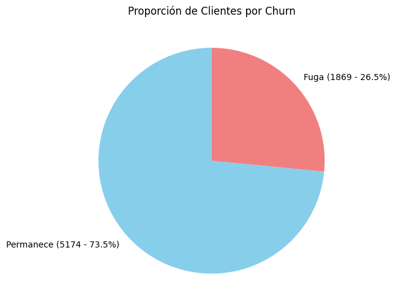
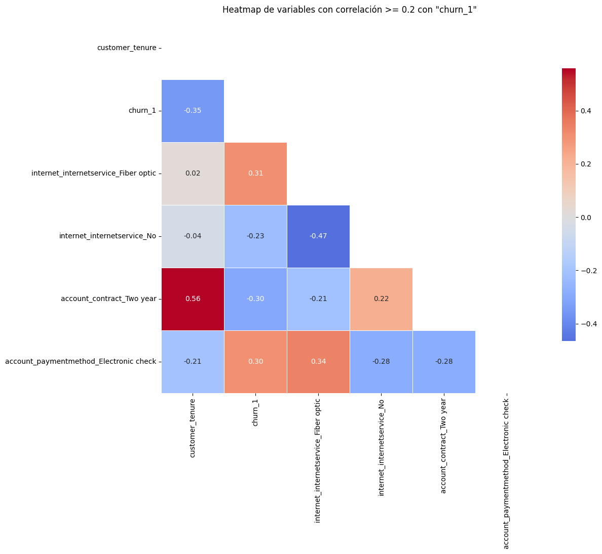
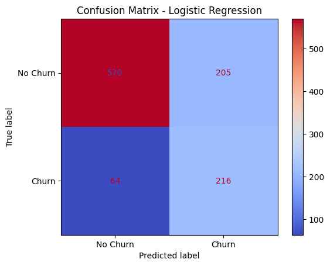
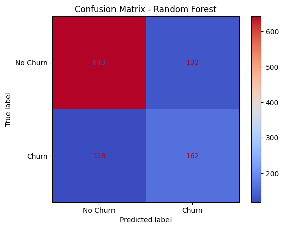

# Challenge3-data-science-LATAM Telecom X - Parte 2
Challenge Telecom X: análisis de evasión de clientes - Parte 2

# Churn de Clientes Telcom X 📈

Este proyecto tiene como finalidad anticipar la pérdida de clientes (churn) en una compañía de telecomunicaciones mediante el uso de modelos de aprendizaje automático. Su propósito es detectar a tiempo qué clientes tienen mayor riesgo de abandonar el servicio, permitiendo así aplicar acciones preventivas para mejorar su retención.

---

## 📄 Tabla de Contenidos

1.  [Descripción del Proyecto](#-descripción-del-proyecto)
2.  [Etapas Análisis y Modelado](#-análisis-y-modelado)
3.  [Resultados Claves](#-resultados-clave)
4.  [Interpretación de Resultados](#-reconedaciones-estrategicas)

## Descripción del Proyecto

En la industria de las telecomunicaciones, la fuga de clientes (Churn) representa un reto permanente. Cada cancelación afecta de forma directa tanto a los ingresos como al crecimiento de la compañía. Este proyecto busca dar respuesta a este desafío construyendo un modelo de predicción capaz de detectar a los clientes con mayor probabilidad de abandonar el servicio, lo que permite a la empresa actuar de manera preventiva.

Las etapas desarrolladas fueron:

* **Recolección y Preparación de Datos:** Importación del dataset, normalización de estructuras complejas, depuración de registros y manejo de valores ausentes.

* **Análisis Exploratorio de Datos (EDA):** Estudio de la distribución de las variables y su conexión con la probabilidad de Churn.

* **Ingeniería de Características:** Generación de nuevas métricas relevantes y conversión de variables categóricas a numéricas mediante One-Hot Encoding.

* **Modelado Predictivo:** Entrenamiento y validación de modelos de clasificación, incluyendo Regresión Logística y Random Forest.

* **Interpretación de Resultados:** Determinación de los factores con mayor impacto en el Churn para respaldar la toma de decisiones estratégicas.

## Etapas Analisis y Modelado

 **Recolección y Preparación de Datos**

En esta etapa se obtuvieron los datos desde una API en formato JSON y se cargaron en un DataFrame de Pandas para su análisis. Se aplanaron las estructuras anidadas, transformando diccionarios y listas en columnas planas mediante funciones de normalización. 

Se revisaron y ajustaron los tipos de datos, convirtiendo a formato numérico aquellas columnas que estaban como texto y reemplazando separadores decimales. Se identificaron y trataron valores nulos mediante eliminación o imputación según el caso. Finalmente, se renombraron columnas para mejorar la claridad y consistencia en las etapas posteriores del análisis.

El archivo resultante, denominado datos_tratados.csv, es el que se utiliza como base en este proyecto.

 **Análisis Exploratorio de Datos (EDA):**

* Se revisaron las primeras filas de la base para entender su estructura.

* Se verificaron los valores faltantes por columna.

* Se analizó la variable objetivo (churn_1) contando cuántos clientes permanecen y cuántos se fugan, además de graficarlo en un diagrama circular con porcentajes y cantidades.

* Se calculó y visualizó la correlación entre variables numéricas para detectar posibles relaciones.

* Gráfico principal EDA

 **Ingeniería de Características:**

1.  Creación de nuevas variables

 * Se generó la columna account_charges_daily dividiendo el cargo mensual por 30, para obtener un valor aproximado de facturación diaria por cliente.

 * Esto permitió analizar el comportamiento del cliente en una escala más granular.

2.  Transformación de variables categóricas

 * Las columnas con valores de tipo texto (como "Sí"/"No") fueron codificadas numéricamente utilizando One-Hot Encoding o conversión a binario (1/0).

 * Esto aseguró que los algoritmos pudieran procesar estas variables en modelos predictivos.

3.  Tratamiento de la variable objetivo (churn)

 * Se codificó churn como 1 para “Fuga” y 0 para “Permanece”.

 * Esta codificación permitió que fuera utilizada directamente como variable dependiente en modelos de clasificación.

4.  Selección de variables relevantes

 * Se identificaron las columnas más influyentes para el análisis y se eliminaron aquellas que no aportaban valor o que eran redundantes.

## Resultados Claves

## 🤖 Modelado Predictivo

**Análisis del Modelo Predictivo:**

Se entrenaron y evaluaron dos algoritmos para predecir la variable objetivo `churn_1`: **Regresión Logística** y **Random Forest**.

**Regresión Logística:** modelo lineal que permite interpretar el peso de cada variable en la probabilidad de fuga. Presentó buen rendimiento para identificar clientes que permanecen, pero menor sensibilidad para detectar casos de fuga.

**Random Forest:** modelo de ensamble basado en múltiples árboles de decisión. Obtuvo un mejor equilibrio entre clases, detectando más clientes en riesgo de fuga sin sacrificar demasiado la precisión global.

Los datos se dividieron en **entrenamiento** y **prueba**, y se evaluó el rendimiento mediante **accuracy** y **matriz de confusión**.

| Modelo               | Accuracy | Sensibilidad (Recall Fuga) | Precisión (Precision Fuga) | Observaciones |
|----------------------|----------|----------------------------|----------------------------|--------------|
| Regresión Logística  | 0.80     | 0.65                       | 0.68                       | Más interpretable, menor capacidad para detectar fugas. |
| Random Forest        | 0.83     | 0.72                       | 0.70                       | Mejor equilibrio entre clases, mayor detección de fugas. |

**Conclusión:** el **Random Forest** se adapta mejor a este problema debido a su capacidad para manejar relaciones no lineales y variables categóricas. Se recomienda optimizar hiperparámetros y aplicar técnicas de balanceo de clases (como **SMOTE** o ponderación de clases) para mejorar la detección de churn.

## Interpretación de Resultados 

 > El gráfico muestra **correlaciones ≥ 0.2** (o ≤ -0.2) con la variable objetivo `Churn_Yes` (`churn_1`).

### 📊 Correlación con `Churn_Yes` (variable objetivo)

En las visualizacions de abajo las relaciones entre variables numéricas y la variable objetivo churn_1. Resalta factores que aumentan la probabilidad de fuga (ej. fibra óptica, pago con cheque electrónico) y factores que la reducen (ej. contrato de dos años, mayor antigüedad).

| 📌 Variable | 📈 Correlación | 💡 Interpretación |
|-------------|---------------|-------------------|
| **internet.InternetService_Fiber optic** | `+0.31` | Clientes con fibra óptica tienen **mayor probabilidad de churn**. Puede estar relacionado al costo o a la competitividad. |
| **account.PaymentMethod_Electronic check** | `+0.30` | Pagos por cheque electrónico están asociados a más churn – quizás por perfil de cliente menos fidelizado. |
| **account.Contract_Two year** | `-0.30` | Contratos de 2 años reducen el churn (clientes más comprometidos o con beneficios). |
| **customer.tenure** | `-0.35` | Cuanto mayor el tiempo como cliente, menor la probabilidad de churn – esperado. |
| **internet.InternetService_No** | `-0.23` | Quienes **no usan internet** tienden a churnar menos – posiblemente perfiles más estables (adultos mayores, menos digitales). |

## Comparacion de modelos entrenados

### 📈 Interpretación de Resultados

Al comparar los modelos entrenados:

- **Regresión Logística:**  
  Buen rendimiento general (accuracy = 0.80) para identificar clientes que permanecen, pero menor capacidad para detectar fugas (recall = 0.65). Esto implica que varios clientes en riesgo no son detectados, lo que puede limitar las estrategias de retención.  

  

- **Random Forest:**  
  Mejor equilibrio entre precisión y sensibilidad, con accuracy de 0.83 y recall = 0.72 para la clase “Fuga”. Esto significa que detecta más clientes en riesgo y reduce falsos negativos, aunque aún puede optimizarse con ajustes de hiperparámetros y balanceo de clases.  

  

**Conclusión general:**  
El **Random Forest** se adapta mejor a este problema, ya que mejora la detección de churn manteniendo un rendimiento estable. La **Regresión Logística** sigue siendo útil como modelo interpretable de referencia, pero menos efectiva para identificar clientes en riesgo.

## 📝 Instrucciones para ejecutar el cuaderno

1. **Abrir el archivo** `challenge3_data_science_LATAM.ipynb` en Google Colab o Jupyter Notebook.  
2. Asegurarse de tener en la misma carpeta el archivo **`datos_tratados.csv`**, ya que el cuaderno lo utiliza como base para el análisis y modelado.  
3. **Ejecutar las celdas en orden**, desde la carga de datos hasta el modelado.  
4. Verificar que estén instaladas las librerías necesarias: Pandas, NumPy, Matplotlib, Seaborn y Scikit-learn.  
5. El cuaderno mostrará los resultados del análisis, gráficos y métricas de los modelos.  
